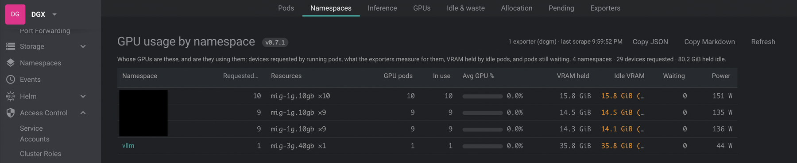
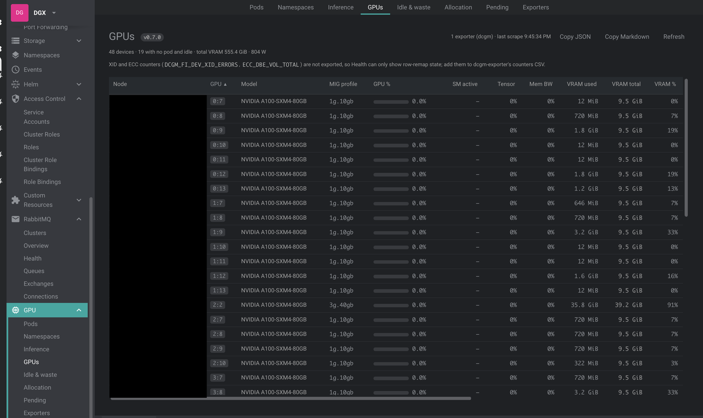
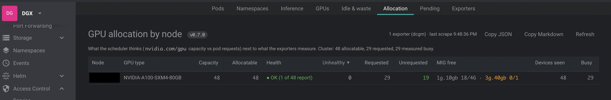
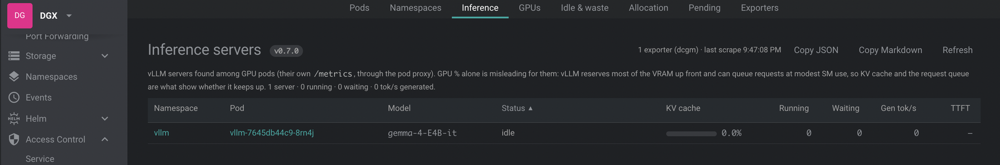

# @freelensapp/gpu-extension

<!-- markdownlint-disable MD013 -->

[](https://freelens.app)
[](https://github.com/freelensapp/freelens-gpu-extension)
[](https://deepwiki.com/freelensapp/freelens-gpu-extension)
[](https://github.com/freelensapp/freelens-gpu-extension/releases)
[](https://github.com/freelensapp/freelens-gpu-extension/actions/workflows/unit-tests.yaml)
[](https://github.com/freelensapp/freelens-gpu-extension/actions/workflows/integration-tests.yaml)
[](https://www.npmjs.com/package/@freelensapp/gpu-extension)

<!-- markdownlint-enable MD013 -->

## Overview

[Freelens](https://freelens.app) extension for **GPUs**: per-pod and
per-device GPU usage inside the tool you already use for the cluster.

Utilisation, VRAM, power and health for every pod that holds a GPU and for
every card or MIG slice, plus a GPU section in the Pod and Node detail
drawers. Zero cluster footprint: the extension discovers a GPU metrics
exporter you already run (NVIDIA **dcgm-exporter** from the GPU Operator, or
any **per-process exporter** emitting `gpu_process_memory_bytes`) and scrapes
it through the kube-apiserver **pod-proxy subresource**, over the cluster
connection Freelens already has. No DaemonSet, no port-forward, no Prometheus
required. Everything lives in the cluster sidebar under **GPU**: **Pods**,
**Namespaces**, **Inference**, **GPUs**, **Idle & waste**, **Allocation**,
**Pending** and **Exporters**.

It is the GUI counterpart of
[`kubectl-gpugo`](https://github.com/Tal-Naeh/kubectl-gpugo)
(`kubectl krew install gpugo`) and shares its attribution rules and data
model, so both tools show the same numbers.









Screenshots from an 8x A100 DGX with MIG; node and internal namespace names
are blacked out.

## Requirements

- **Freelens >= 1.8.0.** Verified on Freelens 1.10.3, the version the
  integration tests run against.
- **An exporter the extension recognises**, running in the cluster:
  - **dcgm-exporter**: image contains `dcgm-exporter`, or `/metrics` emits
    `DCGM_FI_DEV_*`. Per-pod attribution needs `--kubernetes` (the GPU
    Operator default); without it you get per-(node, GPU) rows with the
    candidate pods listed.
  - **Per-process exporter**: anything whose `/metrics` emits
    `gpu_process_memory_bytes` with `namespace`/`pod` labels. Preferred when
    present, because it attributes workloads that bypass the device plugin
    via `NVIDIA_VISIBLE_DEVICES=all`.
- **Kubernetes access** through the kubeconfig Freelens uses for the
  cluster: `list pods` cluster-wide and `list nodes` (discovery and the
  Allocation view), `get pods/proxy` in the exporter's namespace (the
  scrape), plus `list services` and `get services/proxy` for the Prometheus
  fallback.
- **Node.js** is required only when building the extension from source; it
  is not needed to run it. The package is a self-contained bundle.

## Supported sources

<!-- markdownlint-disable MD013 -->

| Source | Found through | Attribution |
| --- | --- | --- |
| NVIDIA dcgm-exporter with pod labels (`--kubernetes`, the GPU Operator default) | Running pods whose name, image or labels mention `dcgm`, `gpu`, `nvidia` or `cuda`, probed on `/metrics` and classified by content (`DCGM_FI_DEV_*`) | One row per pod, one per MIG slice on partitioned cards |
| dcgm-exporter without pod labels | The same probe | One row per (node, GPU) with the candidate pods of that node |
| Per-process exporter | `/metrics` emitting `gpu_process_memory_bytes` with `namespace` and `pod` labels | Per process, also for workloads that bypass the device plugin with `NVIDIA_VISIBLE_DEVICES=all`; power split by VRAM share |
| Prometheus, Thanos, VictoriaMetrics or Mimir query API | Found automatically in the cluster, or pinned as `namespace/svc/name:port`, through the service proxy | The same metrics, with the labels Prometheus rewrites repaired; used when no exporter pod answers |
| Pinned exporter pods | `namespace/pod-prefix:port` on the **Exporters** page, per cluster | As above, by the content of `/metrics` |

<!-- markdownlint-enable MD013 -->

## Installation

Install the extension from the Freelens **Extensions** page
(`ctrl`+`shift`+`E` or `cmd`+`shift`+`E`) by npm name:

```text
@freelensapp/gpu-extension
```

Alternatively, download the `.tgz` from the
[GitHub releases](https://github.com/freelensapp/freelens-gpu-extension/releases)
page and drag it into the Freelens window, or provide its path on the
Extensions page. After an upgrade, fully restart Freelens; the page title
shows the loaded version.

You can also build and pack the extension yourself, see
[Build from the source](#build-from-the-source).

## Getting started

1. Connect to a cluster in Freelens. A **GPU** group appears in the
   cluster's left sidebar.
2. **Pods** shows every GPU-holding pod; click a header to sort, drag its
   edge to resize.
3. **GPUs** shows each card or MIG slice with the pods sharing it. **Idle &
   waste** lists pods holding VRAM at near-zero utilisation and how long they
   have been idle. **Allocation** compares `nvidia.com/gpu` capacity, pod
   requests and measured busy devices per node.
4. Open any Pod or Node: a **GPU** section appears in its details drawer when
   the object holds a GPU.
5. Nothing found? **Exporters** lists every candidate pod that was probed and
   why it was or was not accepted. **Refresh** re-runs discovery. **Pending**,
   **Namespaces** and **Inference** work without a GPU exporter.

## Features

- **Autodiscovery**: lists pods, keeps Running ones whose name, image or
  labels mention `dcgm`, `gpu`, `nvidia` or `cuda`, probes each `/metrics`
  and classifies by content: NVIDIA **dcgm-exporter** (`DCGM_FI_DEV_*`) or a
  **per-process exporter** (`gpu_process_memory_bytes`). Nothing to configure,
  nothing to deploy. If discovery misses yours, **pin** it per cluster on the
  Exporters page (`namespace/pod-prefix:port`).
- **Prometheus fallback**: when no exporter pod answers, reads the same
  metrics from a Prometheus, Thanos, VictoriaMetrics or Mimir query API
  already in the cluster (found automatically, or pinned as
  `namespace/svc/name:port`) through the service proxy, repairing the labels
  Prometheus rewrites.
- **Zero cluster footprint**: reads `/metrics` through the kube-apiserver
  pod-proxy subresource over the Freelens cluster connection. No DaemonSet,
  no Prometheus required, no port-forward, no RBAC beyond `list pods`,
  `list nodes`, `get pods/proxy` (plus `list services` and
  `get services/proxy` for the Prometheus fallback).
- **Correct attribution**: per pod when the exporter carries pod labels; per
  MIG slice on partitioned cards (rows grouped under their physical GPU); per
  process when workloads bypass the device plugin with
  `NVIDIA_VISIBLE_DEVICES=all`; graceful per-(node, GPU) fallback with
  candidate pods otherwise. Same rules as
  [`kubectl-gpugo`](https://github.com/Tal-Naeh/kubectl-gpugo), so CLI and
  GUI agree.
- **Eight views** under a **GPU** sidebar group (below), plus GPU sections in
  the Pod and Node detail drawers.
- **Tables that behave**: click a header to sort, drag its right edge to
  resize (double-click resets, widths are remembered), sticky header while
  scrolling, full text on hover; pod, node and namespace names open the
  Freelens details panel.
- **Copy snapshot**: every page has *Copy JSON* and *Copy Markdown*: the
  whole cluster's GPU state (health issues and waiting pods first) ready to
  paste into Slack or Jira during an incident.
- **Honest numbers**: device gauges are never double-counted; MIG power is
  counted once per card; pods on a shared or time-sliced GPU are badged
  because dcgm-exporter reports device-level numbers for them; the profiling
  counters (SM, tensor and memory activity) sit next to "GPU %", which is
  only kernel time; health shows "not exported" rather than a reassuring OK
  without data; and the version badge in every title tells you which build
  you are looking at.

### Views

All eight are fed by the same 20 s scrape (Pending, Namespaces and Inference
work without a GPU exporter):

<!-- markdownlint-disable MD013 -->

| View | Question it answers |
| --- | --- |
| **Pods** | Which pods hold GPUs right now, on which card or MIG slice, at what utilisation, VRAM and power. Sorted by physical GPU so pile-ups are obvious; `shared xN` and `time-sliced` badges mark device-level numbers. |
| **Namespaces** | Whose GPUs are these, and are they using them: per namespace, devices requested (by resource), devices in use, mean utilisation, VRAM held, VRAM held idle, pods waiting, power. |
| **Inference** | vLLM servers next to their GPUs: model, **KV cache**, running and waiting requests, generated tokens/s, recent time to first token, prefix-cache hit rate, preemptions and errors, with a status (*saturated* when the KV cache is full and requests queue). Found automatically among GPU pods. |
| **GPUs** | One row per physical GPU or MIG slice: model, MIG profile, utilisation, **SM active, Tensor and Mem BW** (DCGM profiling counters), VRAM used, total and %, power, temperature, **Health** (XID with its meaning, uncorrectable ECC, row remapping, hardware throttling), and the pods sharing it. Cards with no pod are listed too. |
| **Idle & waste** | Pods holding VRAM at under 5 % utilisation, with how long they have been idle (history kept while Freelens is open). The first place to look before buying more GPUs. |
| **Allocation** | Per node: **health** (worst device, red when the device plugin withdrew GPUs), GPU capacity (`nvidia.com/gpu` plus `nvidia.com/mig-*`), allocatable, **unhealthy** (capacity minus allocatable), what pods request, **free MIG slices per profile**, and what the exporters measure as busy. Scheduler view and reality side by side. |
| **Pending** | Pods waiting for a GPU: how long, what they request, the scheduler's message, and a **Why** for requests that can never fit (a resource no node offers, `nvidia.com/gpu` on a MIG-partitioned cluster, more devices than any node has). |
| **Exporters** | What discovery found: each exporter's kind (or "via Prometheus"), node, scrape latency and body size, every candidate probed and why it was or was not accepted, and the **pinned targets** for this cluster. |

<!-- markdownlint-enable MD013 -->

Also:

- **Pod details drawer**: a GPU section for pods that hold a GPU (silent for
  the rest), including a warning when the pod's GPU is unhealthy.
- **Node details drawer**: health badge, device summary (count, model, VRAM,
  power, max temperature) plus every GPU row on that node.
- The page title carries the extension version so you always know what you
  are looking at.

<!-- markdownlint-disable MD013 -->

| Column | Meaning |
| --- | --- |
| GPU | GPU index(es): `2` (single), `0`,`1` (two cards), `0:8` (MIG slice 8 of GPU 0) |
| GPU % | Activity across the pod's GPUs (DCGM `GPU_UTIL`, or `PROF_GR_ENGINE_ACTIVE` on MIG) |
| VRAM used | Framebuffer used, summed across the pod's GPUs or slices |
| VRAM total | Used plus free framebuffer for those GPUs or slices |
| Power | Watts; on shared GPUs, a proportional share by VRAM |

<!-- markdownlint-enable MD013 -->

### How it works

See [ARCHITECTURE.md](./ARCHITECTURE.md). In short: `podsApi.list()`, then
a keyword filter, then a probe of each candidate's `/metrics` through
`/api-kube/api/v1/namespaces/<ns>/pods/<pod>:<port>/proxy/metrics`, a
classification by content, a tiny built-in Prometheus text parser, the
aggregation per pod and per device (a port of the kubectl-gpugo scraper), and
a MobX store that polls every 20 s while a GPU view is mounted.

## Limits

- Time-slicing (not MIG) on dcgm-exporter reports identical per-GPU numbers
  for every pod sharing the card; only a per-process exporter can split
  those.
- Auto-discovery is keyword and content based. An exporter with an unusual
  name **and** unusual metric families is skipped; pin it on the Exporters
  page.
- Freelens must be able to reach the pod-proxy subresource with the RBAC of
  your kubeconfig; restricted tokens without `pods/proxy` cannot work.
- The idle history behind **Idle & waste** is kept in memory while Freelens
  is open; it starts again at every launch.
- The extension targets the Freelens 1.x extension API. The port to the
  Freelens v2 API will be a new major version.

## Development

Node 24.15.0 (`.nvmrc`, `mise.toml`) and `corepack pnpm`. Run the local
gates after every change:

```sh
pnpm type:check
pnpm lint:check      # biome (lint:fix to auto-format)
pnpm trunk:check     # Markdown, YAML and the other formats
pnpm build           # electron-vite, then a Main bundle smoke test
pnpm knip:check
pnpm test:unit       # vitest: parser and aggregation against src/renderer/gpu/__tests__/fixtures
```

Try it without a GPU, on any kind cluster:

```sh
integration/fixtures/gpu/up.sh && integration/fixtures/gpu/wait.sh
```

The scripts advertise fake GPU capacity on the nodes and run busybox pods
that serve the exporter fixtures of the unit tests at `/metrics`, so
discovery and every view behave exactly as with the real DaemonSet (see
[integration/fixtures/gpu](./integration/fixtures/gpu)). Any pod named like
`*dcgm-exporter*` that serves one of those files works too.

The Playwright integration tests in [integration/](./integration) run in CI
inside a packaged Freelens on a two-node kind cluster, against that fixture.

More about the repository:

- [ARCHITECTURE.md](./ARCHITECTURE.md): the data path and the attribution
  rules.
- [CONTRIBUTING.md](./CONTRIBUTING.md): ground rules, pull requests and the
  release process.
- [CHANGELOG.md](./CHANGELOG.md): what each release adds and changes.
- [AGENTS.md](./AGENTS.md): the guide for coding agents.

## Build from the source

You can build the extension from this repository.

### Prerequisites

Use [NVM](https://github.com/nvm-sh/nvm),
[mise-en-place](https://mise.jdx.dev/), or
[windows-nvm](https://github.com/coreybutler/nvm-windows) to install the
required Node.js version.

From the root of this repository:

```sh
nvm install
# or
mise install
# or
winget install CoreyButler.NVMforWindows
nvm install 24.15.0
nvm use 24.15.0
```

Install pnpm:

```sh
corepack install
# or
curl -fsSL https://get.pnpm.io/install.sh | sh -
# or
winget install pnpm.pnpm
```

### Build extension

```sh
pnpm i
pnpm build
pnpm pack
```

One script to build and pack the extension for testing:

```sh
pnpm pack:dev
```

This bumps a throwaway prerelease version, builds, and writes a
`freelensapp-gpu-extension-*.tgz` into the repo root. The version bump makes
Freelens treat each rebuild as an upgrade, so re-installing actually reloads
your changes.

### Install built extension

The tarball will be placed in the current directory. In Freelens, navigate
to the Extensions page (`ctrl`+`shift`+`E` or `cmd`+`shift`+`E`) and provide
the path to the tarball, or drag and drop the `.tgz` file into the Freelens
window. Enable it if prompted, then fully restart Freelens after an upgrade.

### Check code statically

```sh
pnpm lint:check
```

or

```sh
pnpm trunk:check
```

and

```sh
pnpm build
pnpm knip:check
```

### Testing the extension with unpublished Freelens

In the Freelens working repository:

```sh
rm -f *.tgz
pnpm i
pnpm build
pnpm pack -r
```

Then in the extension repository:

```sh
echo "overrides:" >> pnpm-workspace.yaml
for i in ../freelens/*.tgz; do
  name=$(tar zxOf $i package/package.json | yq -r .name)
  echo "  \"$name\": $i" >> pnpm-workspace.yaml
done

pnpm clean:node_modules
pnpm build
```

## Credits

Originally created and developed by [Tal Naeh](https://github.com/Tal-Naeh)
as `@tal-naeh/freelens-gpu-extension`, and maintained by him as part of the
Freelens organisation since October 2026.

## License

Copyright (c) 2026 Tal Naeh.

[MIT License](https://opensource.org/licenses/MIT)
